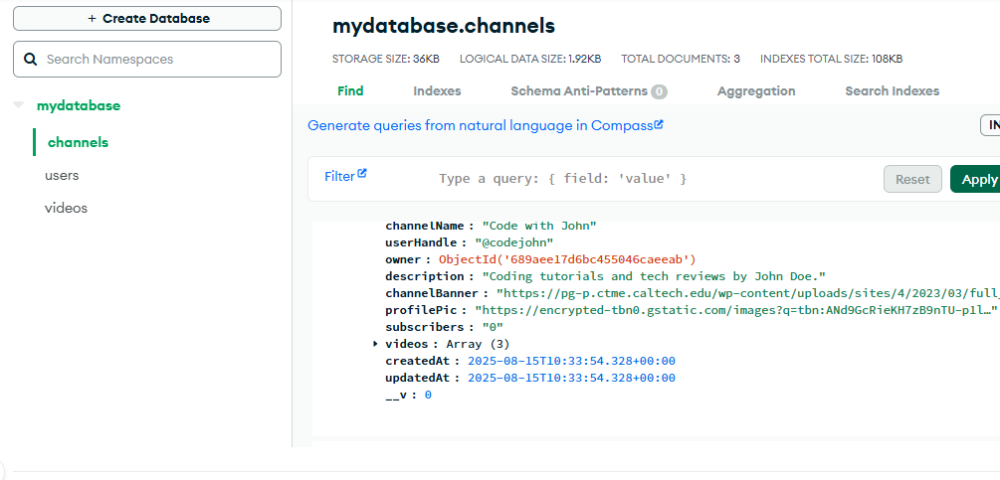
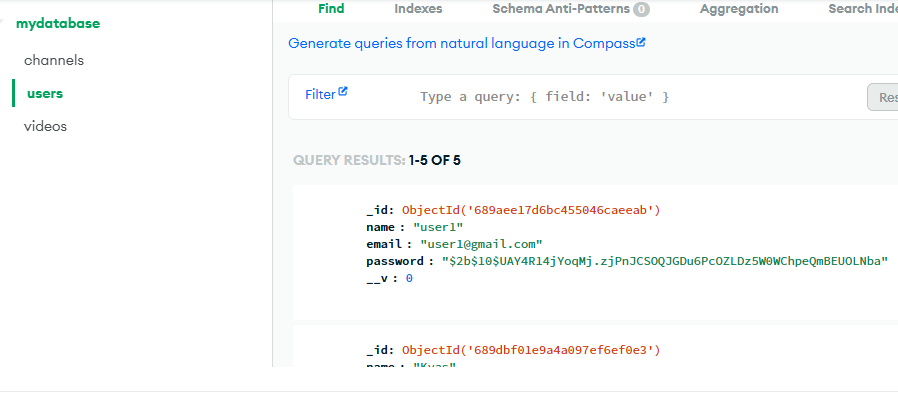
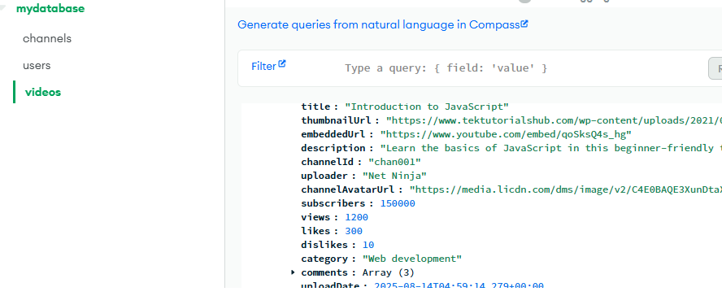

# YouTube Clone Project

A full-stack YouTube-like video sharing platform built with React (frontend) and Node.js/Express/MongoDB (backend).

---

## Features

- **User Authentication:** Sign up, sign in, JWT-based authentication.
- **Channel Management:**  
  - Only signed-in users can create a channel.
  - Each user can have their own channel.
- **Video Management:**  
  - Upload videos to your channel  but here using some embeded url not uploding .
  - Edit or delete your own videos.
  - View a list of videos belonging to a channel.
- **Video Player:**  
  - Watch videos with view count, likes/dislikes, and comments.
- **Comments:**  
  - Add, edit, and delete comments on videos.
- **Responsive UI:**  
  - Modern, responsive design using React and CSS.

---

## Folder Structure

```
clone-project-internshala/
├── public/
├── src/
│   ├── api/                # Axios API instances
│   ├── assets/             # Static assets
│   ├── Components/         # React components
│   ├── services/           # API service functions
│   ├── App.jsx             # Main App component
│   ├── main.jsx            # Entry point
│   └── index.css           # Global styles
├── package.json
├── README.md
└── ...
```

---

## Getting Started

### Prerequisites

- Node.js (v16+ recommended)
- MongoDB ( Atlas)

### Backend Setup

1. **Clone the repository** (if backend is in a separate folder, navigate there):

   ```sh
     already given in backend readme file
   cd backend
   ```

2. **Install dependencies:**

   ```sh
   npm install
   ```

3. **Configure environment variables:**

   Create a `.env` file (if needed) and set:
   ```
   MONGODB_URI=mongodb://localhost:27017/youtube-clone
   JWT_SECRET=your_secret_key
   ```

4. **Start the backend server:**

   ```sh
   node server.js
   ```
   The backend runs on [http://localhost:5300](http://localhost:5300).

---

### Frontend Setup

1. **Navigate to the frontend folder:**

   ```sh
   cd clone-project-internshala
   ```

2. **Install dependencies:**

   ```sh
   npm install
   ```

3. **Start the frontend dev server:**

   ```sh
   npm run dev
   ```
   The frontend runs on [http://localhost:5173](http://localhost:5173) (or as shown in your terminal).

---

## API Endpoints

### Authentication

- `POST /api/auth/login` — Login, returns JWT token.

### Channels

- `POST /api/channels` — Create a channel (auth required)
- `GET /api/channels/:channelId/videos` — List videos for a channel

### Videos

- `POST /api/channels/:channelId/videos` — Upload video (auth + channel owner)
- `PUT /api/videos/:videoId` — Edit video (auth + owner)
- `DELETE /api/videos/:videoId` — Delete video (auth + owner)
- `GET /api/videos/:videoId` — Get video details

---

## Environment Variables

- `VITE_API_URL` (frontend, if using): Set your backend API base URL.

---

## Customization

- Update styles in `src/style.css` or `src/App.css`.
- Change backend MongoDB URI or JWT secret in `.env`.


## Troubleshooting

- **404 on video/channel fetch:**  
  Ensure you are using the correct API base URL and your backend is running.
- **CORS errors:**  
  Make sure CORS is enabled in your backend (`app.use(cors())`).
- **MongoDB connection issues:**  
  Check your MongoDB URI and that MongoDB is running.

---

## Screenshots






**GitLink frontend**----- (https://github.com/upendra4543/YouTube-clone-Project-internshala)
**GitLink backend**----- (https://github.com/upendra4543/youtube-clone-backend)